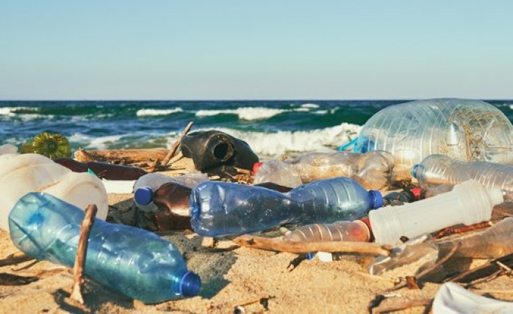
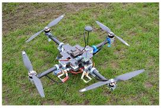

# Introduction
The world, including South Africa, has long struggled with litter. As manufacturing has grown, so has the tendency for people to dispose of waste carelessly, often dumping it wherever they please. To maintain the beauty of our cities, it's important that we address this issue and find ways to preserve their aesthetic appeal.

The traditional approach to tackling litter involves hiring individuals or gathering communities to clean up. However, this method is often hindered by limited financial resources and the fact that many people lack the time to dedicate to such efforts. As engineers and scientists, it is our responsibility to innovate and develop solutions to this persistent problem. Fortunately, we are living in an era where automation is increasingly accessible, with advancements in robotics and AI offering promising opportunities for addressing this issue.

# Background
The issue of litter is a pervasive problem in many South African towns and cities, with significant environmental, health, and economic impacts. The primary sources of litter include inadequate waste management infrastructure, litter from households and businesses, and waste from agricultural and industrial activities. The most common types of waste found in these areas are plastic, glass, organic waste, and paper and cardboard.

The environmental and health impacts of litter are substantial, with pollution of waterways and oceans, harm to wildlife, and negative impacts on human health. Furthermore, litter contributes to the aesthetic degradation of public spaces, including streets, parks, and beaches.

Municipalities with limited financial resources often struggle to maintain cleanliness, particularly in areas with inadequate waste management infrastructure. While there are existing initiatives and technologies being used to address litter, including community-based clean-up initiatives, education and awareness campaigns, and waste management programs, there is still a need for innovative and effective solutions.

One potential solution is an automated system that can collect and dispose of waste without incurring significant ongoing costs. A drone-based system, such as AeroSweep, could potentially address this need by collecting rubbish from the ground and rivers and transporting it to a designated trash site. By leveraging advancements in robotics and AI, such a system could provide a cost-effective and efficient solution to the litter problem.

# Proposed Solution
The proposed solution is to use a quadcopter, a type of drone that is well-suited for spacious environments. Quadcopters can move freely and are not limited by terrain.

> [!NOTE]
> While this project needs to be practical and optimal to solve the problem, the entire design will be done from scratch for experience and fun.

## Project specifications
 - The goal is to build a drone that can pickup individual pieces of litter. 
 - The drones speed needs to match that of a human doing the same job.
 - Large or multiple objects will be ignored and focused thereon later.
 - The drone is only required to operate in terrains such that the process is allowed to disturb the terrain. (For example, grass might get caught in the gripper and therefore grasslands will be excluded)

## Drone Specification Constraints
To design a quadcopter we need to design the following:

1. **Max capacity**: Determining the maximum capacity of the quadcopter is crucial as it will influence several other design parameters. It will dictate how much waste the quadcopter can collect in one go, directly impacting its effectiveness.

2. **Max Runtime**: The max runtime will depend on the battery capacity, motor efficiency (related to motor thrust), and the weight of the quadcopter including its payload. Thus, after deciding on the motor thrust and understanding the weight implications, one can design for max runtime.

3. **Operation speed**: Operation speed can be considered after understanding the motor thrust and the overall weight of the quadcopter. It's about balancing the need for efficient travel between collection and disposal points with the stability and safety of the operation.

Due to budgeting these values must be at an optimal value. We need to optimize $\text{cost}:\text{efficientcy}$ ratio.

### **Design Targets**
The goal is to produce an equivalent drone to the average human capacity. According to research from Gemini with the following prompt:

> [!Gemini Prompt]
> I am trying to find research that indicates how much waste one person cleans in littered areas on average. Conversation [here](https://g.co/gemini/share/4cbd070eca62).

We get the following research based off 40+ websites.

| Program Name                        | Year (if applicable) | Number of Volunteers | Total Trash Collected (pounds) | Total  Recyclables Collected (pounds) | Average Waste per Volunteer (pounds) | Estimated Waste per Person per Hour (pounds) |
| ----------------------------------- | -------------------- | -------------------- | ------------------------------ | ------------------------------------- | ------------------------------------ | -------------------------------------------- |
| California Coastal Cleanup Day      | 2024                 | 46,201               | 332,861                        | 65,793                                | 10.05                                | 3.35                                         |
| California Coastal Cleanup Day      | 2024                 | 28,751               | 254,772                        | N/A                                   | 8.86                                 | 2.95                                         |
| International Coastal Cleanup (ICC) | N/A                  | 18,000,000+          | 380,000,000+                   | N/A                                   | 21.11                                | N/A (duration varies)                        |

To match that of a human we need to collect 1.5 kilograms of waste per hour. Which means that if hour drone pickups one item per minute, we are looking at 25g per load. This means that we only need to design a drone that can handle 25g load max. However, we need to apply a safety factor of 10x.

- Safety factor = 10
- Load = 250g

The target has been set to 25g/min. The actual operational speed is situational. These factors are determined by:
- How long the drone takes to go from target to drop off zone?
- How long the AI takes to process?
- How quick the AI can identify object?
- How heavy a single piece of litter actually is?

Therefore, we might not meet the requirement. However, we'll work around this eventually.

According to another study if residents pickup 150 odd pieces of litter a day. There would be temporarily no litter left. Therefore, the target per day should be 150 pieces. On average a single piece of litter weights about 20g. Therefore, we are looking at 3kg per day.

Thus we can work the operational time as:
$$
\text{time}=\frac{3\text{kg}}{25\text{g/min}}=\text{120 min}
$$

> [!Design Targets]
> - Operational time: 120 min
> - Cleaning speed: 25g/min
> - Max load mass: 250g

## Gripper Design

## Flight System Design

System weight:
- Load: 0.25kg
- Controller: 0.03kg
- Frame: 0.5kg

## Software Design
There are three higher level systems:
- System AI
- Flight Controller
- Gripper Controller

### System AI
The idea is to identify individual litter objects. We can either use a yolo model or we can use a vLLM called Molmo. 

Molmo is a vLLM where questions can be asked about an image. It also has a pointing capability to find the coordinates of an object on an image. Molmo is for more generalized situations where the object is unknown and not trained in the yolo dataset.

There exists pretrained YOLO model to detect litter in Kaggle. This can be used to individual detect litter.

This part of the operation can be done off device. Therefore, we can use a gpu server, kaggle, gcloud or open router.

Once the target has been identified notify flight controller

### Flight Controller
- Responsible to move to location identified by system ai

### Gripper Controller
- Use VLA to pickup object, identified by system ai.
- Or is there a more efficient way to pickup objects without damaging the environment